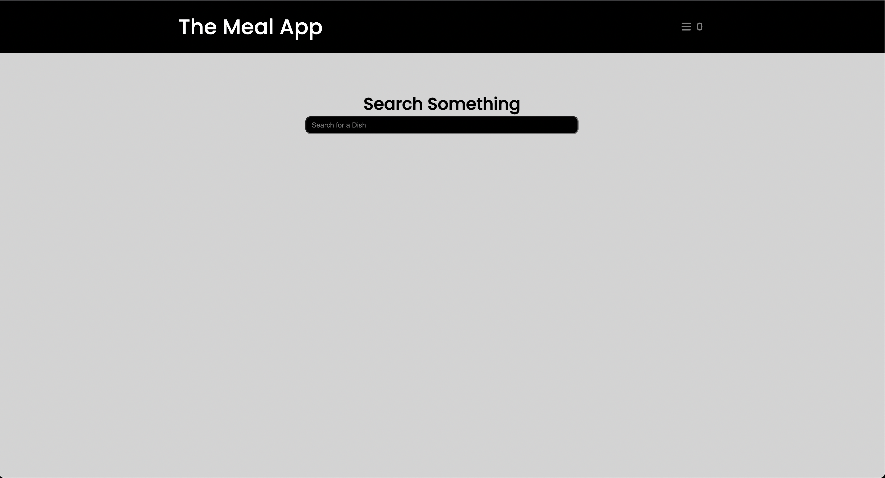
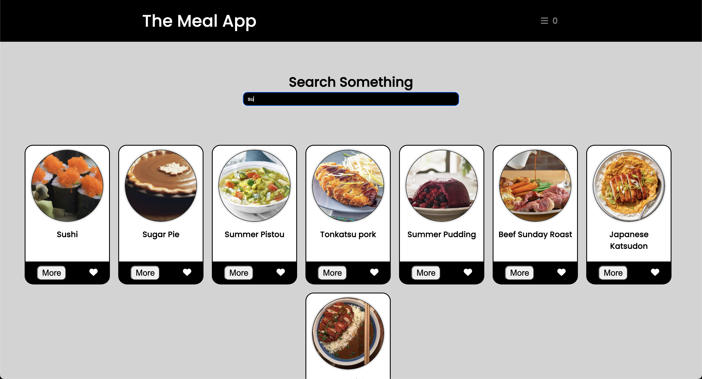
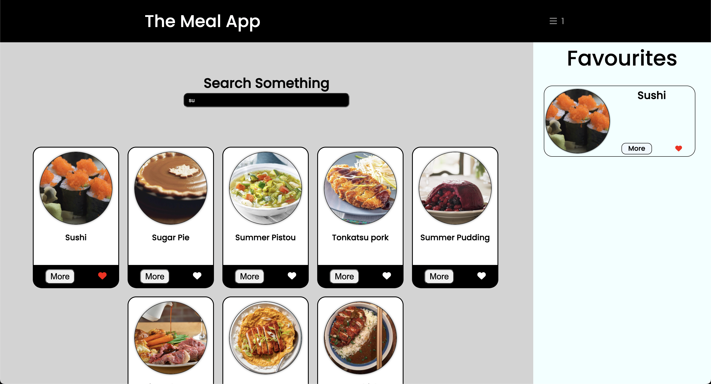
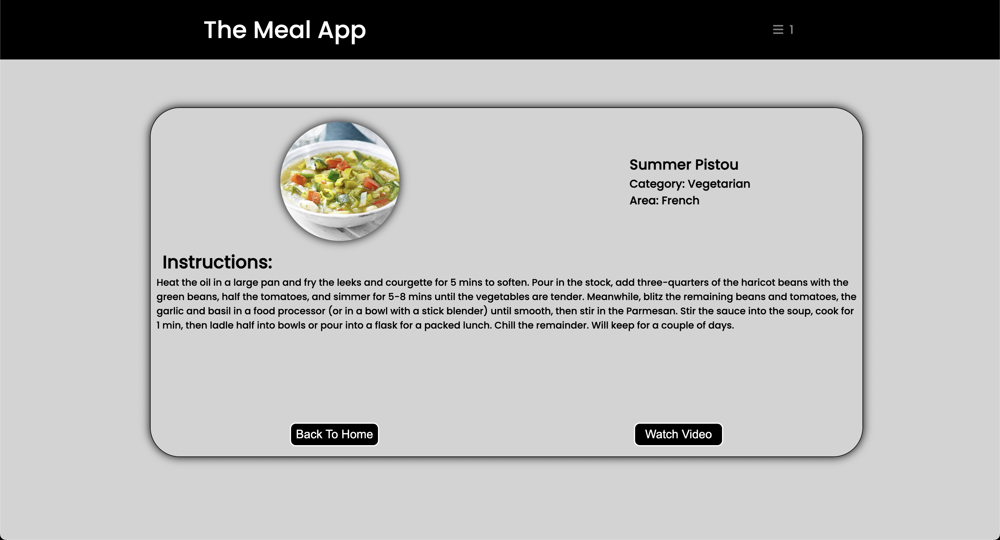

#About The Project

-> This website serves as a single-page platform enabling users to search for information on various meals.

-> Additionally, users have the capability to add meals to their favorites list. 

-> Noteworthy is the project's full responsiveness and utilization of an API named "themealdb" to retrieve comprehensive information about all featured dishes. 

-> Furthermore, the website directs users to corresponding YouTube videos for detailed recipes of the selected dishes.

##Overview of the website

### The Home Page

### Page With Search

### Favourite Section

### Individual Meal page

